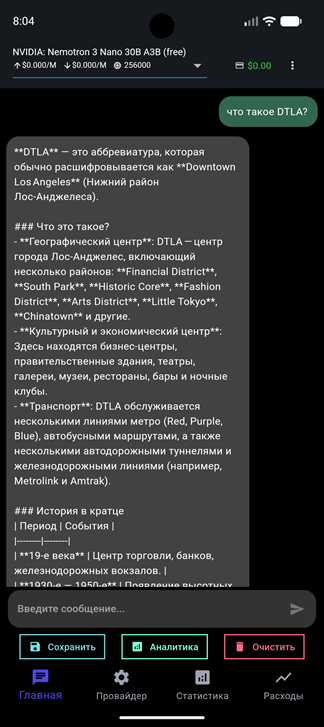
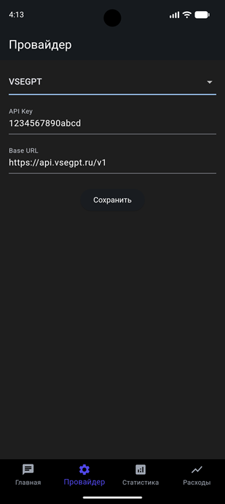
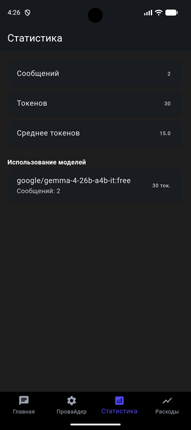
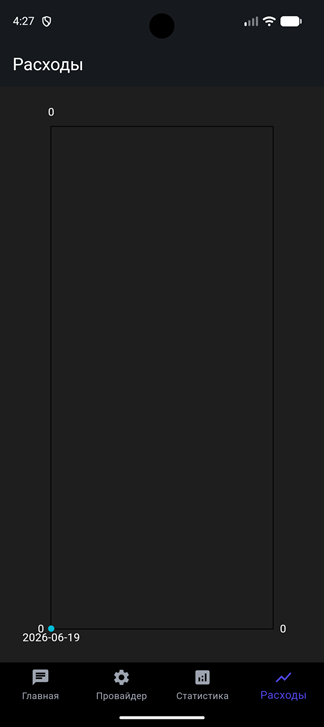

# AIChatFlutter мобильный AI-чат на Flutter

Android-приложение, разработанное на Flutter для общения с современными языковыми моделями искусственного интеллекта. Приложение поддерживает работу через OpenRouter и VseGPT, позволяя использовать различные модели ИИ через единый удобный интерфейс.

## Поддерживаемые провайдеры

### OpenRouter

* Отображение баланса в долларах США ($)
* Расчет стоимости запросов на основе цены за миллион токенов
* Доступ к большому количеству моделей от разных поставщиков
* Единый API для работы с несколькими ИИ-платформами

### VseGPT

* Отображение баланса в российских рублях (₽)
* Расчет стоимости сообщений по тарифам за тысячу токенов
* Поддержка популярных языковых моделей
* Удобная работа с оплатой в рублях

---

## Архитектура проекта

### Основные директории

#### `lib/`

Исходный код приложения.

**Главные файлы и модули:**

* `main.dart` — точка входа в приложение

##### `api/`

Модули взаимодействия с внешними API.

* `openrouter_client.dart` — универсальный клиент для OpenRouter и VseGPT

##### `models/`

Модели данных приложения.

* `message.dart` — модель сообщения с информацией о токенах и стоимости запроса

##### `providers/`

Управление состоянием приложения.

* `chat_provider.dart` — управление чатом, моделями и историей сообщений

##### `services/`

Служебные сервисы приложения.

* `database_service.dart` — работа с локальным хранилищем данных
* `analytics_service.dart` — сбор и анализ статистики использования
* `provider_settings_service.dart` — хранение и управление настройками провайдера

##### `screens/`

Основные экраны приложения.

* `main_navigation_screen.dart` — основная навигация
* `chat_screen.dart` — экран общения с ИИ
* `provider_settings_screen.dart` — настройки API-провайдера
* `statistics_screen.dart` — статистика использования
* `expenses_chart_screen.dart` — график расходов

#### `android/`

Android-конфигурация проекта.

#### `assets/`

Изображения, иконки и другие ресурсы приложения.

#### `pubspec.yaml`

Список зависимостей и настроек Flutter-проекта.

---

## Экраны приложения

Приложение включает несколько основных разделов:

* Чат с языковыми моделями
* Настройки провайдера и API-ключей
* Статистика использования моделей и токенов
* График расходов по дням

---

## Ключевые компоненты

### ChatProvider

Отвечает за управление состоянием приложения:

* ведение истории переписки;
* отправку запросов к OpenRouter и VseGPT;
* контроль расходов и баланса;
* настройку и выбор моделей.

### Message

Модель сообщения, содержащая:

* текст запроса или ответа;
* информацию о модели и количестве использованных токенов;
* стоимость генерации;

### OpenRouterClient

Универсальный API-клиент, обеспечивающий:

* работу с разными провайдерами через единый интерфейс;
* автоматическое определение используемого сервиса;
* корректное отображение стоимости запросов;
* обработку ошибок и повторные попытки выполнения запросов.

### DatabaseService

Сервис локального хранения данных:

* сохранение истории переписки;
* кэширование информации;
* экспорт истории сообщений;
* хранение статистики использования.

### AnalyticsService

Модуль аналитики и мониторинга:

* сбор статистических данных;
* анализ использования моделей;
* учет расхода токенов.

---

## Возможности приложения

### Работа с ИИ

* Общение с различными языковыми моделями
* Выбор модели из списка доступных
* Настройка и поддержка нескольких провайдеров
* Отображение текущего баланса
* Расчет стоимости каждого запроса
* Учет потребления токенов

### Управление историей чата

* Автоматическое сохранение сообщений
* Экспорт истории в формате JSON
* Копирование сообщений в буфер обмена
* Очистка переписки

### Статистика и аналитика

* Статистика использования по дням
* Анализ расхода токенов по моделям
* Отслеживание времени ответа
* Контроль расходов
* Экспорт аналитических данных

### Интерфейс

* Адаптивный дизайн для разных экранов
* Удобная навигация
* Информативные уведомления и сообщения об ошибках

### Технические особенности

* Локальное хранение данных
* Доступ к истории сообщений без подключения к интернету
* Обработка сетевых ошибок и нестабильного соединения

---

## Быстрый старт

1. Склонируйте репозиторий.
2. Создайте файл `.env`, используя `envexample` в качестве шаблона.
3. Укажите данные для подключения к OpenRouter или VseGPT.
4. Установите зависимости и запустите проект согласно инструкции в файле `INSTALL.md`.

---

## Настройка окружения

Для корректной работы необходимо указать следующие параметры в файле `.env`:

* `OPENROUTER_API_KEY` — API-ключ OpenRouter или VseGPT
* `BASE_URL` — адрес используемого API

  * `https://openrouter.ai/api/v1`
  * `https://api.vsegpt.ru/v1`
* `MAX_TOKENS` — максимальное количество токенов в ответе
* `TEMPERATURE` — степень вариативности генерации (от `0.0` до `1.0`)

После настройки приложение готово к работе с выбранным AI-провайдером.
